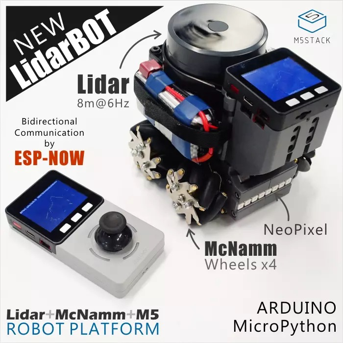

# LidarBot

   LidarBot是能够应用于地图扫描、运动控制研究、路径规划、人工智能、自动驾驶以及多机协同任务的非常强大，好用的轮式机器人套件。
 

## 1、开发环境安装
   点击链接：[https://github.com/m5stack/M5Stack](https://github.com/m5stack/M5Stack)

## 2、原理图

   
   
## 3、源码
  
   雷达车：[Bot](https://github.com/m5stack/Applications/tree/master/LidarBot/Firmware/Lidar_Scan_FW/LidarBotM5_RemoteAndScan_V1.1)
 
   遥控器：[Remote_V1.0](https://github.com/m5stack/Applications-LidarBot/tree/master/LidarBot/Example/LidarBot_RemoteController_V1.0)
   
   遥控器：[Remote_V1.1](https://github.com/m5stack/Applications-LidarBot/tree/master/LidarBot/Example/LidarBot_RemoteController_V1.1)
          修改手柄精度。

## 4、激光车示图

